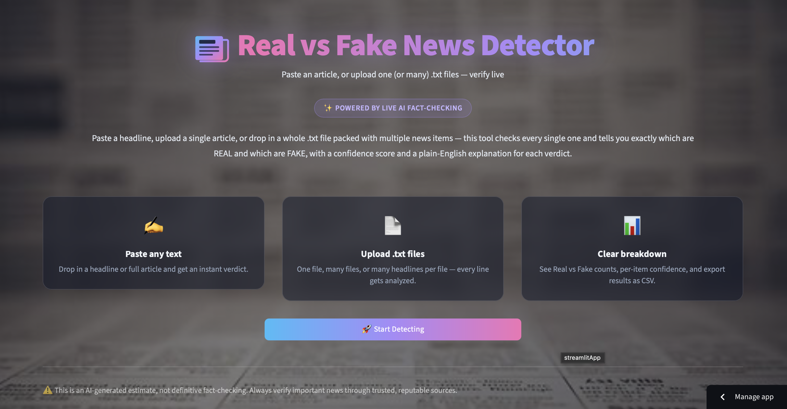
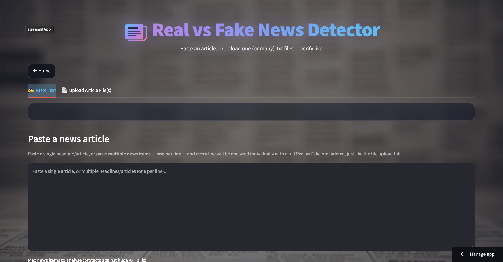
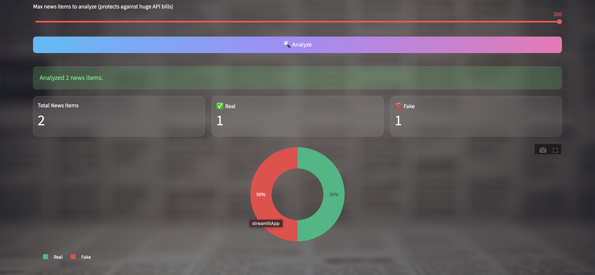
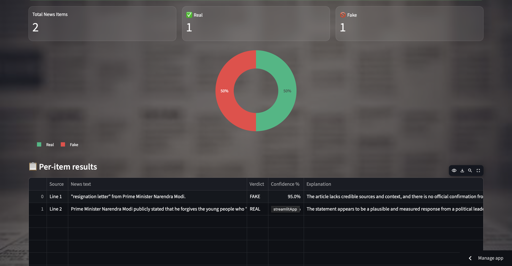
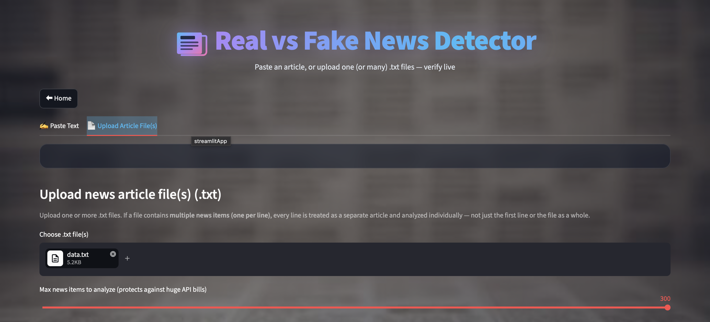
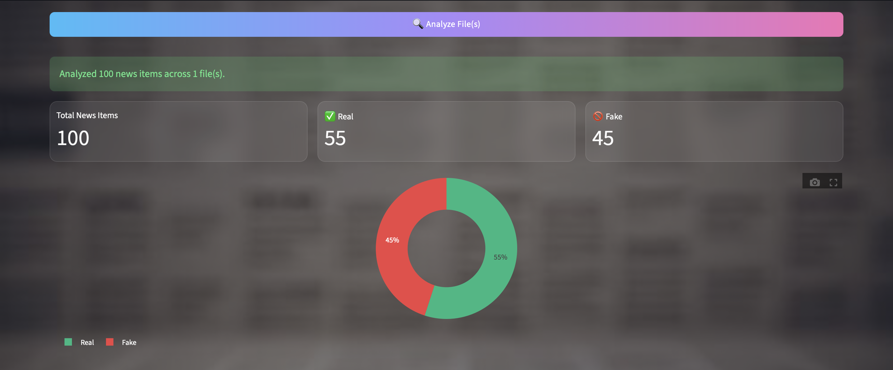
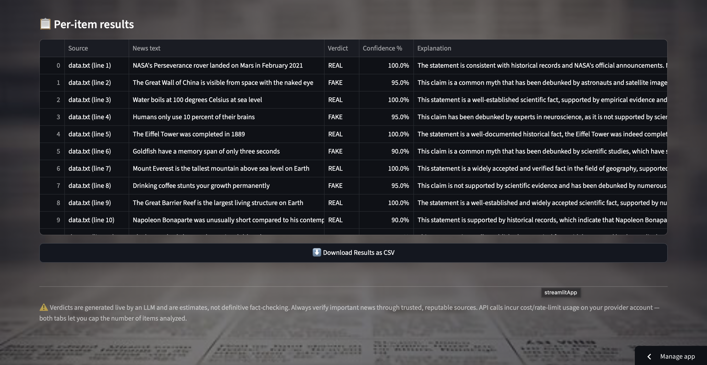

# 📰 Real vs Fake News Detector 

**Paste it. Upload it. Know instantly.**
An AI-powered Streamlit app that fact-checks news headlines and articles in real time — flagging them as **REAL** or **FAKE**, with a confidence score and a plain-English explanation for every verdict.
Try It : https://real-vs-fake-news-detector-aiml.streamlit.app


Try It : https://real-vs-fake-news-detector-aiml.streamlit.app


---

## ✨ Why this project?

Misinformation spreads faster than fact-checkers can keep up. This tool puts a live AI fact-checking layer in your hands — no signup, no cost (runs on Groq's free tier), no waiting. Paste a headline or drop in a whole batch of articles, and get a clear, visual breakdown of what's credible and what's not.

## 🚀 Features

| | |
|---|---|
| ✍️ **Paste any text** | Drop in a single headline/article, or paste **multiple items — one per line** — and every line gets analyzed individually. |
| 📄 **Upload `.txt` files** | Upload one or many files. Multi-line files are automatically split so *every* news item inside gets its own verdict — not just the first line. |
| 🎯 **Confidence scoring** | Every verdict comes with a 0–100% confidence gauge, not just a binary label. |
| 💡 **Plain-English reasoning** | The model explains *why* it reached its verdict — writing style, sensationalism, factual plausibility, and known misinformation patterns. |
| 📊 **Batch breakdown** | Real vs Fake counts, an interactive pie chart, and a full per-item results table for multi-article runs. |
| ⬇️ **CSV export** | Download your batch results for reporting, research, or record-keeping. |
| 🔒 **Secure by design** | Your API key is never rendered in the UI or committed to the repo — loaded server-side via Streamlit Secrets only. |
| 🎨 **Polished UI** | Custom dark theme with a newspaper-textured background, gradient accents, and smooth animations. |

## 🖥️ How it works

```
Your text/file  →  Split into individual news items  →  Sent to LLM (Groq LLaMA 3.3)
                                                              ↓
              CSV export  ←  Pie chart + table  ←  Structured JSON verdict returned
```

Each item is sent to an LLM with a fact-checking system prompt, which returns strict JSON:
```json
{"verdict": "FAKE", "confidence": 87, "explanation": "..."}
```

## 📸 Screenshots

### 1.Home Page

### 2.News Detector by Pasting a News Article text



### 3.News Detector by Uploading a News Article file





## 🛠️ Tech Stack

- **[Streamlit](https://streamlit.io/)** — UI framework
- **[Groq API](https://console.groq.com/)** (OpenAI-compatible) — LLaMA 3.3 70B for classification, free tier
- **[Plotly](https://plotly.com/python/)** — confidence gauges & pie charts
- **[Pandas](https://pandas.pydata.org/)** — results table & CSV export

Swappable providers: the app also supports **Gemini** and **OpenAI** — just change one line (`ACTIVE_PROVIDER`) in the config.

## ⚙️ Getting Started

### 1. Install dependencies
```bash
pip install -r requirements.txt
```

### 2. Add your API key
Create `.streamlit/secrets.toml` (already gitignored — never committed):
```toml
GROQ_API_KEY = "your-groq-api-key-here"
```
Get a free key at [console.groq.com/keys](https://console.groq.com/keys).

### 3. Run the app
```bash
streamlit run app.py
```
Then open **http://localhost:8501** in your browser.

## 📁 Project Structure

```
Fake-News-Detector/
├── app.py                      # Main Streamlit app
├── requirements.txt
├── Images/
│   └── photo.png                # Background image
├── .streamlit/
│   ├── secrets.toml             # Your API key (gitignored)
│   └── secrets.toml.example     # Template for contributors
└── README.md
```

## 🧪 Usage

1. Click **Start Detecting** on the landing page.
2. Choose a tab:
   - **✍️ Paste Text** — one article, or many (one per line)
   - **📄 Upload Article File(s)** — one or more `.txt` files
3. Click **Analyze**.
4. Review the verdict(s), confidence, and explanation.
5. For batches, download the full results as a CSV.

## ⚠️ Disclaimer

Verdicts are generated live by an LLM and are **estimates, not definitive fact-checking**. Always verify important news through trusted, reputable sources.

## 🤝 Contributing

Issues and pull requests are welcome! Ideas worth exploring:
- Source-credibility cross-checking against known outlets
- Multi-language support
- Browser extension version

## 📄 License

Licensed under the [MIT License](LICENSE).

---

<p align="center">Built with ❤️ using Streamlit and Groq</p>
